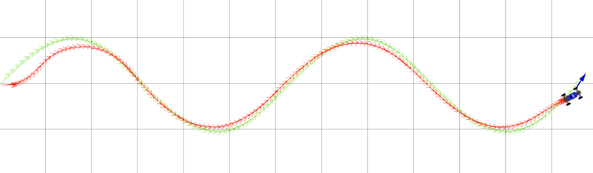
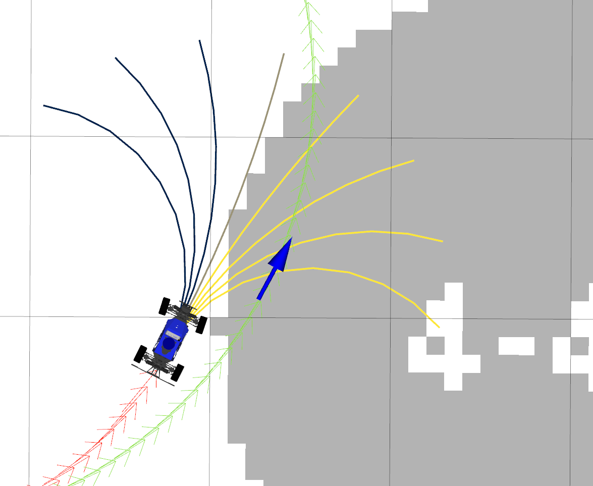
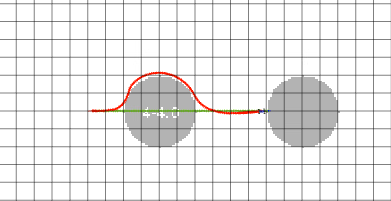

# Motion Control for Car & Robotic Arm  
  
  

A set of ROS-based controllers implementing **PID pure-pursuit** and **Model-Predictive Control (MPC)** for both a MuSHR wheeled vehicle and a WidowX250 robotic arm. 

---

## Table of Contents

- [Overview](#overview)  
- [Features](#features)  
- [Demos & Visuals](#demos--visuals)  

---

## Overview

This repository contains Homework 5 for CS4750 Robotic Foundations, where you’ll implement:  
1. **Reference selection & error computation** for lookahead-based controllers :contentReference[oaicite:1]{index=1}  
2. **PID pure-pursuit** for path tracking on a MuSHR car and joint‐space control on WidowX250 :contentReference[oaicite:2]{index=2}  
3. **MPC** with rollout sampling, cost evaluation, and obstacle avoidance in a slalom world :contentReference[oaicite:3]{index=3}  
4. **Automated tests** in `test/` that validate each component :contentReference[oaicite:4]{index=4}

---

## Features

- 📏 **Computing position in frame**: Reference‐state transformation frames for error in the cars postion  
- 🔄 **PID Controller**: Implements proportional, integral, and derivative terms for cross-track error (`PID.get_control`) :contentReference[oaicite:6]{index=6}  
- 🚀 **MPC Controller**: Samples control sequences, rollouts with kinematic car model, and cost‐based action selection (`MPC.get_control`) :contentReference[oaicite:7]{index=7}  
- 🧪 **Test Suites**:  
  - `test/controller.py` for base & PID logic  
  - `test/pid.py` for PID correctness  
  - `test/mpc.py` for MPC sampling & rollout :contentReference[oaicite:8]{index=8}  
- 📊 **Visualization**:  
  - RViz config for real‐time overlay (`control.rviz`)  
  - Plots of error frames, cost landscapes, and path comparisons :contentReference[oaicite:9]{index=9}

---

## Demos & Visuals

### Car Controllers

  
*PID tracking of a “wave” path, showing minimal cross‐track error.* :contentReference[oaicite:10]{index=10}  

  
*MPC rollout costs, highlighting collision penalties vs. distance error.* :contentReference[oaicite:11]{index=11}  

  
*MPC navigating a slalom map under ROS simulation.* :contentReference[oaicite:12]{index=12}  

### Arm Controller

---

## Core Implementation
[**PID Controller.py**](/car_controller/src/car_controller/pid.py) 

[**Model Predictive Controller**](car_controller/src/car_controller/mpc.py)

